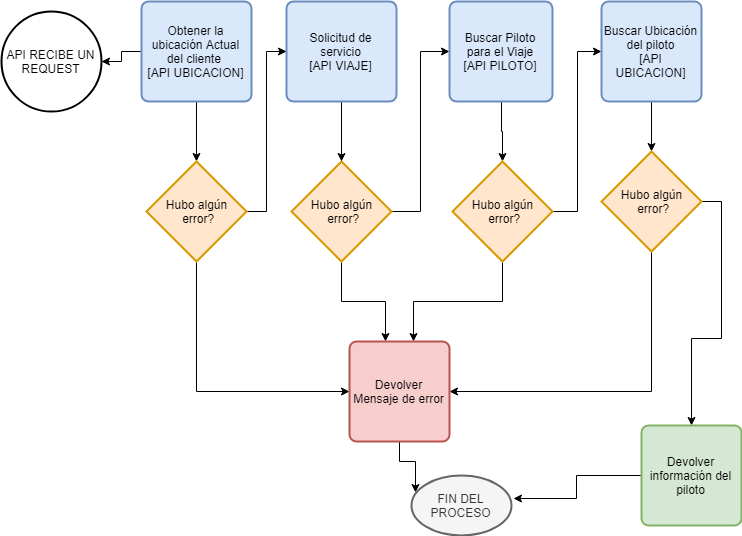

# Contenido
Esta carpeta contiene la implementacion de un servicio que tramita la solicitud de un carro. Llamando a tres microservicos mas: Viaje, Piloto y Ubicacion.

Antes de iniciar el proyecto crear el archivo packege.json con el comando:

```html
    npm init
```
En el cual se debe ingresar datos como el nombre del paquete, version, repositorio de git, palabras claves entre otro. Seguidamente hay que instalarle el modulo "express" para que nos permita crear las APIs, con el comando: 
 
```html
    npm install express
```
---
## ARCHIVO "service.js"
En este archivo encontramos las siguientes secciones.
- [MODULOS UTILIZADOS](#MODULOS-UTILIZADOS)
- [CONFIGURACION BODYPARSER](#CONFIGURACION-BODYPARSER)
- [API](#api)
- [SERVIDOR](#servidor)
---
## MODULOS UTILIZADOS

1. express
2. http
3. bodyParser
4. request

## CONFIGURACION BODYPARSER

Se configura el bodyparser para que analice los cuerpos de solicitud entrantes en un middleware antes de sus manejadores.

## API

Este API maneja la funcionalidad principal, mediante la invocacion de las APIS en un orden logico de tal manera que si ocurre un error lo maneja internamente.

A continuacion se muestra un flujo de trabajo de como funciona internamente este servicio.



## SERVIDOR

Se crea una servidor para que acepte las solicitudes de los consumidores de las APIs, a través del puerto 7002.