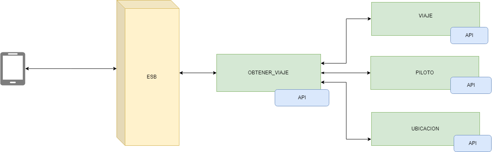

# Contenido
Esta proyecto contiene aplicación SOA para simular algunos servicios de carros tipo Uber. 

Tanto los microservicios y el cliente que se comunica estan desarrollados en NodeJS version "v8.10.0" haciendo uso del editor Visual Studio Code.

El bus de integracion fue realizado a traves de mulesoft en AnyPoint Studio version 7.3.4.

## Diagrama de interraccion

Como se puede ver la aplicacion que en este caso es web, hace invocacion al bus el cual procesa parte de la informacion para detectar que pais desde donde se hace el pedido para enrutarlo hacia un servicio que pertenezca a su respectiva area geografica.

Se hace uso de una api intermediaria ya que es mejor mantener la logica del servicio en una blackbox y unicamente se pueda acceda a traves del bus.