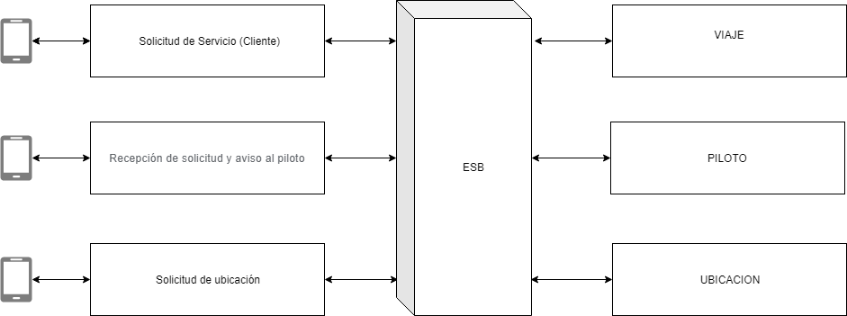
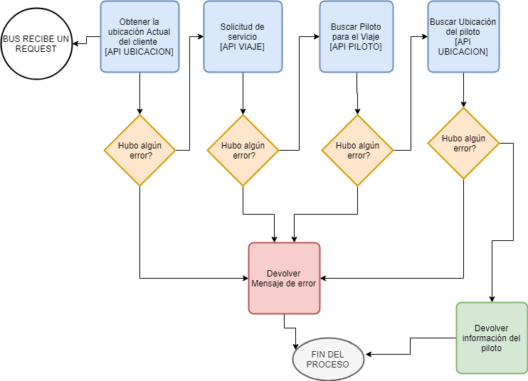

# Contenido
Esta proyecto contiene aplicación SOA para simular algunos servicios de carros tipo Uber. 

Tanto como los microservicios, el api que simula ser un enterprise service bus y el cliente que se comunica estan desarrollados en NodeJS version "v8.10.0" haciendo uso del editor Visual Studio Code.

## Diagrama de interraccion

## Diagrama de flujo de trabajo
A continuacion se muestra el flujo de trabajo que se lleva a cabo internamente dentro del bus.
